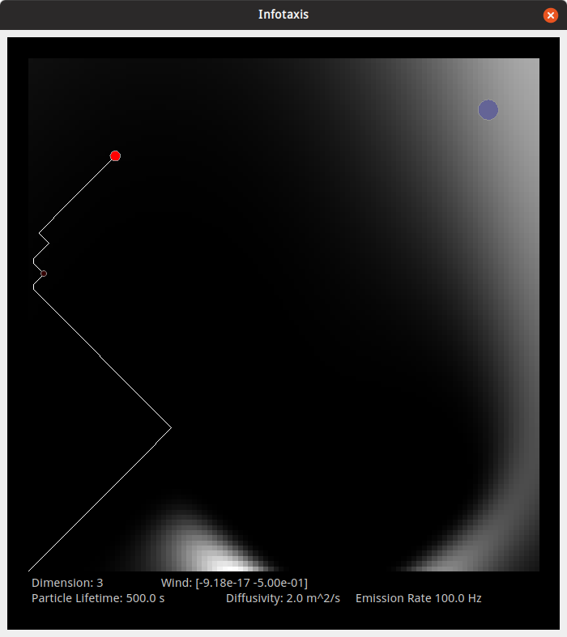
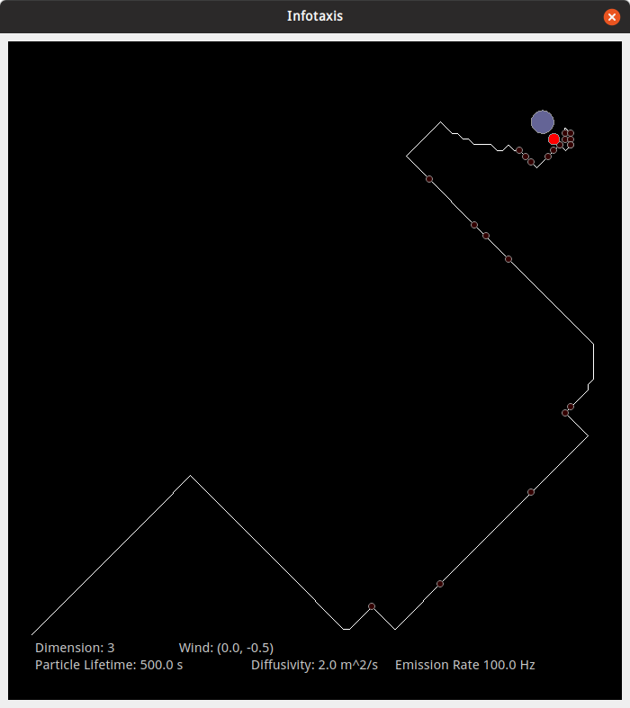

# Infotaxis
This is an implementation of infotaxis based on the paper [*‘Infotaxis’ as a strategy for searching without gradients*](https://www.nature.com/articles/nature05464) by Vergassola M, Villermaux E and Shraiman BI. A detailed introduction to infotaxis as a searching strategy is presented in the paper and its supported information.

This implementation includes 2D and 3D versions of infotaxis, allows wind to blow in an aribitrary direction, and enables the searcher to move in eight directions instead of four.

`infotaxis_gui.py` contains an integrated GUI example and can be directly run with Python 3. Please note that [PyQtGraph](https://pypi.org/project/pyqtgraph/) and [PyQt5](https://pypi.org/project/PyQt5/) should be installed.

## Notations
The moving red dot is the searcher and the big blue dot is the source. Brightness in the background indicates the magnitudes of probabilities that the source is at those corresponding locations. White line is the trajectory and dark-red dots on the line are places where the searcher gets patches.

The sizes of the red dot (searcher) and big blue dot (source) vary according to the radius of the searcher and source, respectively. It is assumed that the searcher's "body" is soft, i.e. part of the dot can exceed the window as long as its center is within the window.

## Some Examples
Finding the source (left) and found the source (right)
 
